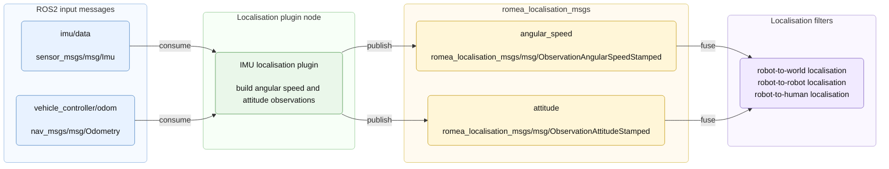

# romea_localisation_imu_plugin

`romea_localisation_imu_plugin` provides a ROS2 localisation plugin node that converts IMU data into `romea_localisation_msgs` observations.

The plugin estimates unbiased yaw angular speed and attitude observations from `sensor_msgs/msg/Imu` messages. It also uses vehicle odometry to detect stationary phases, which allows the underlying core plugin to estimate angular speed bias.

Internally, the ROS2 component wraps the framework-independent IMU localisation plugin provided by `romea_core_localisation_imu`.

## 1) Concept

The IMU localisation plugin is an observation producer. It does not estimate the robot pose by itself. It converts IMU and odometry data into localisation observations that can be fused by localisation filters such as robot-to-world, robot-to-robot or robot-to-human localisation filters.



The odometry input is used to estimate the robot linear speed. This helps detect stationary periods and makes angular speed bias estimation more reliable.

## 2) Provided Plugin

| Executable | Component plugin |
| --- | --- |
| `imu_localisation_plugin_node` | `romea::ros2::localisation::IMUPlugin` |

## 3) Input Topics

| Topic | Type | Use |
| --- | --- | --- |
| `imu/data` | `sensor_msgs/msg/Imu` | IMU acceleration, angular speed and orientation data |
| `vehicle_controller/odom` | `nav_msgs/msg/Odometry` | Vehicle odometry used to detect stationary phases |

## 4) Output Topics

| Topic | Type | Description |
| --- | --- | --- |
| `angular_speed` | `romea_localisation_msgs/msg/ObservationAngularSpeedStamped` | Unbiased yaw angular speed observation |
| `attitude` | `romea_localisation_msgs/msg/ObservationAttitudeStamped` | Roll and pitch attitude observation |

## 5) Parameters

| Parameter | Type | Default | Description |
| --- | --- | --- | --- |
| `restamping` | bool | `false` | If true, observations are stamped with the node clock instead of the IMU message stamp |
| `enable_accelerations` | bool | `true` | If true, linear accelerations from the IMU message are used by the core plugin |
| `debug` | bool | `false` | Enable debug logging |
| `imu.rate` | double | required | IMU update rate, in hertz |
| `imu.acceleration_noise_density` | double | required | Acceleration noise density |
| `imu.acceleration_bias_stability_std` | double | required | Acceleration bias stability standard deviation |
| `imu.acceleration_range` | double | required | Acceleration measurement range |
| `imu.angular_speed_noise_density` | double | required | Angular speed noise density |
| `imu.angular_speed_bias_stability_std` | double | required | Angular speed bias stability standard deviation |
| `imu.angular_speed_range` | double | required | Angular speed measurement range |
| `imu.magnetic_noise_density` | double | required | Magnetic field noise density |
| `imu.magnetic_bias_stability_std` | double | required | Magnetic field bias stability standard deviation |
| `imu.magnetic_range` | double | required | Magnetic field measurement range |
| `imu.heading_std` | double | required | Heading standard deviation |
| `imu.xyz` | double array | required | IMU position in the localisation body frame, in meters |
| `imu.rpy` | double array | required | IMU orientation in the localisation body frame, in degrees |

## 6) Configuration and Run

Run the IMU localisation plugin with:

```bash
ros2 run romea_localisation_imu_plugin imu_localisation_plugin_node \
  --ros-args --params-file path/to/imu_localisation_plugin.yaml
```

Example parameter file:

```yaml
imu_localisation_plugin:
  ros__parameters:
    restamping: false
    enable_accelerations: true
    debug: false
    imu:
      rate: 100.0
      acceleration_noise_density: 0.0005
      acceleration_bias_stability_std: 0.01
      acceleration_range: 160.0
      angular_speed_noise_density: 0.0001
      angular_speed_bias_stability_std: 0.001
      angular_speed_range: 8.7
      magnetic_noise_density: 0.001
      magnetic_bias_stability_std: 0.001
      magnetic_range: 0.0008
      heading_std: 1.0
      xyz: [0.0, 0.0, 0.5]
      rpy: [0.0, 0.0, 0.0]
```

## License

This project is released under the Apache License 2.0. See the `LICENSE` file for details.

## Authors

This package was developed by **Jean Laneurit**.
